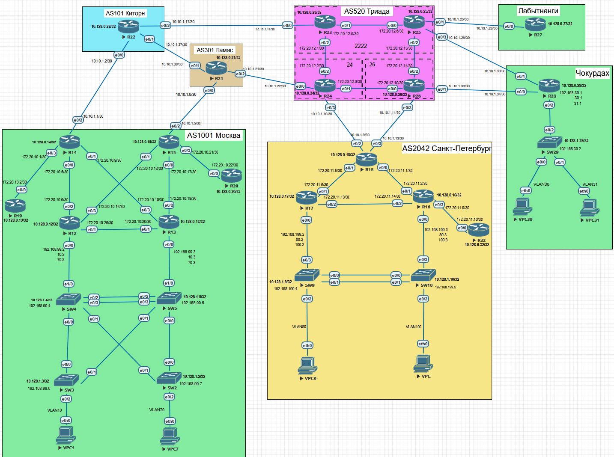
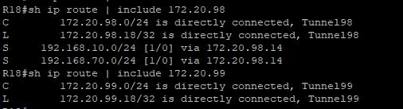
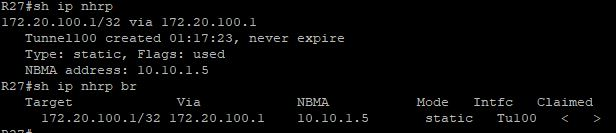
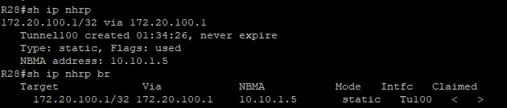
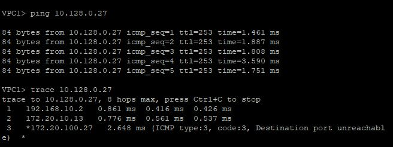
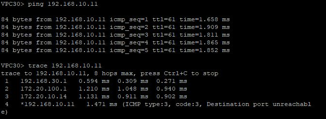
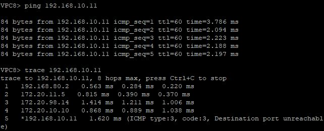

# Отчёт по настройке VPN: GRE и DMVPN

## Цель
- Настроить **GRE-туннель** между офисами **Москва** и **Санкт-Петербург**
- Настроить **DMVPN** между офисами **Москва**, **Чокурдах** и **Лабытнанги**
- Обеспечить **IP-связность между всеми офисами и их сетями**

---

## Топология сети

В лабораторной работе используется распределённая корпоративная сеть с центральным офисом в Москве и филиалами в Санкт-Петербурге, Чокурдахе и Лабытнанги.

- Между офисами **Москва — Санкт-Петербург** используется *GRE-туннель*
- Между офисами **Москва — Чокурдах** и **Москва — Лабытнанги** используется *DMVPN (Hub-and-Spoke)*



---

## Пошаговая настройка

### Настройка GRE между офисами Москва и Санкт-Петербург

Для организации прямого логического соединения между офисами **Москва** и **Санкт-Петербург** настраиваем *GRE-туннель* между граничными маршрутизаторами.

 Настройка GRE на маршрутизаторе **Москва (R14 и R15)**:

**R14**
```bash
interface Tunnel98
 description GRE-R14-to-R18
 ip address 172.20.98.14 255.255.255.0
 keepalive 5 3
 tunnel mode gre ip
 tunnel source 10.10.1.1
 tunnel destination 10.10.1.9
```
**R15**
```bash
interface Tunnel99
 description GRE-R15-to-R18
 ip address 172.20.99.15 255.255.255.0
 keepalive 5 3
 tunnel mode gre ip
 tunnel source 10.10.1.5
 tunnel destination 10.10.1.9
```

 Настройка GRE на маршрутизаторе **Санкт-Петербург (R18)**

```bash
interface Tunnel98
 description GRE-R18-to-R14
 ip address 172.20.98.18 255.255.255.0
 keepalive 5 3
 tunnel mode gre ip
 tunnel source 10.10.1.9
 tunnel destination 10.10.1.1
!
interface Tunnel99
 description GRE-R18-to-R15
 ip address 172.20.99.18 255.255.255.0
 keepalive 5 3
 tunnel mode gre ip
 tunnel source 10.10.1.9
 tunnel destination 10.10.1.5
```

Для передачи маршрутов через GRE прописываем:

**R14**
```bash
ip route 192.168.80.0 255.255.255.0 172.20.98.18
ip route 192.168.100.0 255.255.255.0 172.20.98.18
```

**R15**
```bash
ip route 192.168.80.0 255.255.255.0 172.20.99.18
ip route 192.168.100.0 255.255.255.0 172.20.99.18
```

**R18**
```bash
ip route 192.168.10.0 255.255.255.0 172.20.98.14
ip route 192.168.10.0 255.255.255.0 172.20.99.15 10
ip route 192.168.70.0 255.255.255.0 172.20.98.14
ip route 192.168.70.0 255.255.255.0 172.20.99.15 10
```


В результате GRE-туннель успешно поднят, обеспечена IP-связность между офисами **Москва** и **Санкт-Петербург**.



---

### 2. Настройка DMVPN (Hub) в офисе Москва

Офис Москва выполняет роль *DMVPN Hub*. Для настройки используем **mGRE + NHRP**.

**R15**
```bash
interface Tunnel100
 description DMVPN-HUB-R15
 ip address 172.20.100.1 255.255.255.0
 no ip redirects
 ip mtu 1400
 ip nhrp map multicast dynamic
 ip nhrp network-id 100
 ip tcp adjust-mss 1360
 tunnel source 10.10.1.5
 tunnel mode gre multipoint
 tunnel key 100
```

Настроиваем маршрутизацию:

```bash
router bgp 1001
 bgp listen range 172.20.100.0/24 peer-group DMVPN_SPOKES
 redistribute connected
 redistribute ospf 1
 neighbor DMVPN_SPOKES peer-group
 neighbor DMVPN_SPOKES remote-as 1001
 neighbor DMVPN_SPOKES description DMVPN_SPOKES
 neighbor DMVPN_SPOKES update-source Tunnel100


ip prefix-list CLIENT_NETS seq 10 permit 192.168.10.0/24
ip prefix-list CLIENT_NETS seq 20 permit 192.168.70.0/24
ip prefix-list CLIENT_NETS seq 30 permit 192.168.99.0/24
!
ip prefix-list SPOKE_NETS seq 10 permit 192.168.30.0/24
ip prefix-list SPOKE_NETS seq 20 permit 192.168.31.0/24
ip prefix-list SPOKE_NETS seq 30 permit 192.168.39.0/24
!
route-map FILTER_CLIENT_NETS deny 10
 match ip address prefix-list CLIENT_NETS SPOKE_NETS
!
route-map FILTER_CLIENT_NETS permit 20
!
route-map OSPF_CLIENT_NETS permit 10
 match ip address prefix-list CLIENT_NETS
!
route-map OSPF_CLIENT_NETS deny 20
```

В результате *DMVPN Hub* в офисе  **Москва** готов к подключению филиалов.

---

### Настройка DMVPN (Spoke) в офисе Лабытнаги

Маршрутизатор в офисе **Лабытнаги (R27)** настраиваем как *DMVPN Spoke* и подключаем к Hub в офису **Москва**.

**R27**
```bash
interface Tunnel100
 description DMVPN-SPOKE-R27
 ip address 172.20.100.27 255.255.255.0
 no ip redirects
 ip mtu 1400
 ip nhrp map 172.20.100.1 10.10.1.5
 ip nhrp map multicast 10.10.1.5
 ip nhrp network-id 100
 ip nhrp nhs 172.20.100.1
 ip tcp adjust-mss 1360
 tunnel source 10.10.1.26
 tunnel mode gre multipoint
 tunnel key 100
```

Выполняем настройку маршрутизации:

```bash
router bgp 1001
 bgp router-id 10.128.0.27
 bgp log-neighbor-changes
 network 10.128.0.27 mask 255.255.255.255
 neighbor 172.20.100.1 remote-as 1001
 neighbor 172.20.100.1 description HUB-R15
 neighbor 172.20.100.1 update-source Tunnel100
```

В результате филиал **Лабытнаги** успешно зарегистрировался на *DMVPN Hub*.



---

### 4. Настройка DMVPN (Spoke) в офисе Чокурдах

Маршрутизатор в офисе **Чокурдах (R28)** настраиваем как *DMVPN Spoke* и подключаем к Hub в офису **Москва**.

**R28**
```bash
interface Tunnel100
 description DMVPN-SPOKE-R28
 ip address 172.20.100.28 255.255.255.0
 no ip redirects
 ip mtu 1400
 ip nhrp map 172.20.100.1 10.10.1.5
 ip nhrp map multicast 10.10.1.5
 ip nhrp network-id 100
 ip nhrp nhs 172.20.100.1
 ip tcp adjust-mss 1360
 tunnel source 10.10.1.34
 tunnel mode gre multipoint
 tunnel key 100
```

Выполняем настройку маршрутизации:

```bash
router bgp 1001
 bgp router-id 10.128.0.28
 bgp log-neighbor-changes
 network 10.128.0.28 mask 255.255.255.255
 network 192.168.30.0
 network 192.168.31.0
 network 192.168.39.0
 neighbor 172.20.100.1 remote-as 1001
 neighbor 172.20.100.1 description HUB-R15
 neighbor 172.20.100.1 update-source Tunnel100
 maximum-paths ibgp 2
```
Для доступа только определенных сетей, прописываем *access-list* и *route-map*

```bash
ip access-list extended ACL_TO_HUB
 permit ip 192.168.30.0 0.0.0.255 192.168.0.0 0.0.255.255
 permit ip 192.168.31.0 0.0.0.255 192.168.0.0 0.0.255.255
 permit ip 192.168.39.0 0.0.0.255 192.168.0.0 0.0.255.255

route-map BALANCE permit 5
 match ip address ACL_TO_HUB
 set interface Tunnel100
```
Поскольку у нас несколько каналов связи, то на стороне провайдера **Киторн** на маршрутизаторах **R25** и **R26** прописываем:

**R25**
```bash
ip route 10.10.2.0 255.255.255.0 10.10.1.30
ip route 10.10.3.0 255.255.255.0 10.10.1.30
```

**R26**
```bash
ip route 10.10.2.0 255.255.255.0 10.10.1.34
ip route 10.10.3.0 255.255.255.0 10.10.1.34
```


В результате филиал **Чокурдах** подключён к *DMVPN Hub* офиса **Москва** и маршруты успешно обмениваются.



---

### 5. Обеспечение IP-связности между офисами

Для проверки IP-связности выполнялись пинги между интерфейсами маршрутизаторов и клиентскими сетями филиалов:







В результате все офисы имеют полную IP-связность через GRE и DMVPN-туннели.

---

## Выводы

- Настроен *GRE-туннель* между офисами **Москва** и **Санкт-Петербург**.
- Реализована *DMVPN-сеть* между офисами **Москва**, **Чокурдах** и **Лабытнанги**.
- Обеспечена IP-связность всех корпоративных сетей и Loopback-адресов.

Файлы конфигурации оборудования приведены [здесь](/Labs/task13/config/).